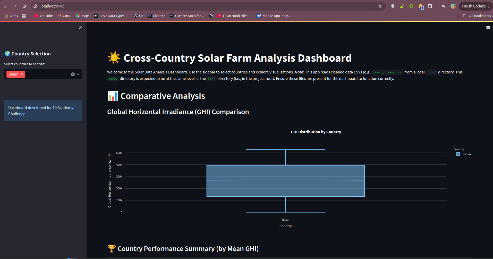
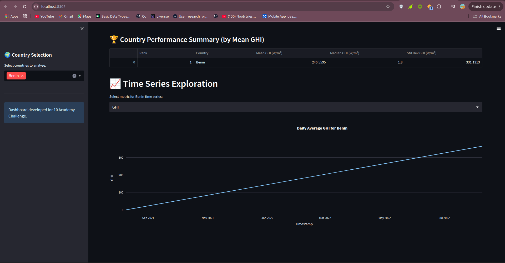
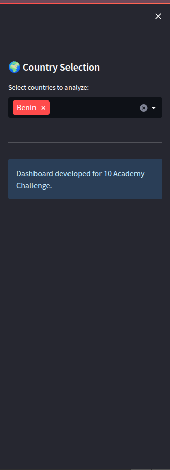

# Solar Challenge Week 1: Cross-Country Solar Farm Analysis

This repository contains the work for the 10 Academy Week 1 Challenge, focusing on the understanding, exploration, and analysis of solar farm data from Benin, Sierra Leone, and Togo. The goal is to identify key trends and insights to support strategic solar investments.

## Project Overview

The project involves several key stages:
1.  **Environment Setup & Git Workflow:** Establishing a robust development environment, version control practices, and a CI pipeline.
2.  **Data Profiling, Cleaning & EDA:** Performing detailed Exploratory Data Analysis for each country's dataset to understand data quality, identify patterns, and prepare the data for comparison.
3.  **Cross-Country Comparison:** Synthesizing cleaned datasets to identify relative solar potential and key differences across Benin, Sierra Leone, and Togo.
4.  **Interactive Dashboard (Bonus):** Developing a Streamlit application to visualize insights and allow interactive exploration of the data.

## Tasks Completed

### Task 1: Git & Environment Setup
*   Initialized a GitHub repository (`solar-challenge-week1`).
*   Set up a Python virtual environment (`venv`).
*   Implemented a Git branching strategy (`setup-task` branch merged into `main`).
*   Created a `.gitignore` file to exclude data, virtual environments, and other non-essential files.
*   Established a `requirements.txt` for managing project dependencies.
*   Added a basic GitHub Actions CI workflow (`.github/workflows/ci.yml`) to install dependencies.
*   Defined a standard project folder structure.

### Task 2: Data Profiling, Cleaning & EDA (for Benin, Sierra Leone, Togo)
*   Created separate EDA branches (e.g., `eda-benin`) and Jupyter notebooks (e.g., `notebooks/benin_eda.ipynb`) for each country.
*   **Summary Statistics & Missing Value Report:** Generated descriptive statistics and identified columns with missing values.
*   **Outlier Detection & Basic Cleaning:**
    *   Investigated outliers in key sensor readings (GHI, DNI, DHI, ModA, ModB, WS, WSgust) using boxplots and Z-scores.
    *   Handled missing values through imputation (e.g., median for sensor data, 0 for precipitation).
    *   Exported cleaned DataFrames to `data/<country>_clean.csv` (these CSVs are gitignored).
*   **Time Series Analysis:** Plotted GHI, DNI, DHI, and Ambient Temperature over time, observing daily and monthly patterns.
*   **Cleaning Impact Analysis:** Assessed the effect of cleaning events on module sensor readings (ModA, ModB).
*   **Correlation & Relationship Analysis:** Generated heatmaps and scatter plots to understand relationships between variables like GHI, DNI, DHI, module temperatures, wind speed, and relative humidity.
*   **Wind & Distribution Analysis:** Created wind roses (if applicable) and histograms for GHI and wind speed.
*   **Temperature Analysis:** Examined the influence of relative humidity on temperature and solar radiation.
*   **Bubble Charts:** Visualized relationships like GHI vs. Tamb with bubble size representing RH or Barometric Pressure.

### Task 3: Cross-Country Comparison
*   Created a `compare-countries` branch and `notebooks/compare_countries.ipynb`.
*   Loaded the cleaned CSV datasets for Benin, Sierra Leone, and Togo.
*   **Metric Comparison:**
    *   Generated side-by-side boxplots of GHI, DNI, DHI, colored by country.
    *   Created a summary table comparing mean, median, and standard deviation of GHI, DNI, DHI across countries.
*   **Statistical Testing:** Performed a Kruskal-Wallis test on GHI values to assess if differences between countries are statistically significant.
*   **Key Observations:** Summarized standout findings from the comparative analysis.
*   **(Bonus) Visual Summary:** Ranked countries by average GHI using a bar chart.

### Bonus Task: Interactive Dashboard
*   Created a `dashboard-dev` branch.
*   Developed a Streamlit application (`app/main.py` with helper functions in `app/utils.py`).
*   The dashboard allows users to:
    *   Select one or more countries for analysis.
    *   View comparative boxplots for GHI.
    *   See a table summarizing key metrics and ranking countries.
    *   Explore time series data for selected metrics if a single country is chosen.
*   The application reads cleaned CSV data from a local `data/` directory (which is gitignored).
*   The application code is designed for potential deployment (e.g., on Streamlit Community Cloud), where it will indicate if local data files are not found.

## Project Structure


├── .github/
│ └── workflows/
│ └── ci.yml
├── .gitignore
├── README.md
├── requirements.txt
├── app/ # Streamlit Dashboard Application
│ ├── init.py
│ ├── main.py
│ └── utils.py
├── data/ # (Gitignored) Cleaned data CSVs reside here
│ ├── benin_clean.csv
│ ├── sierraleone_clean.csv
│ └── togo_clean.csv
├── dashboard_screenshots/ # Screenshots for README
│ ├── Screenshot_20250521_200045.png
│ ├── Screenshot_20250521_200102.png
│ └── Screenshot_20250521_200124.png
├── notebooks/ # Jupyter notebooks for EDA and comparison
│ ├── init.py
│ ├── benin_eda.ipynb
│ ├── sierraleone_eda.ipynb
│ ├── togo_eda.ipynb
│ └── compare_countries.ipynb
├── src/ # (If used for source Python modules)
│ └── init.py
├── tests/ # (If used for unit tests)
│ └── init.py
└── scripts/ # (If used for utility scripts)
└── init.py


## Environment Setup and Running the Project

### Prerequisites
*   Git
*   Python 3.8+ (Python 3.12 was used during development; ensure `setuptools` is up-to-date if using Python 3.12+)
*   `venv` (Python's built-in virtual environment tool) or `conda`

### Environment Reproduction Steps

1.  **Clone the repository:**
    ```bash
    git clone https://github.com/YourUsername/solar-challenge-week1.git
    cd solar-challenge-week1
    ```
    *(Replace `YourUsername` with your actual GitHub username)*

2.  **Create and activate a virtual environment:**
    *   Using `venv` (recommended):
        ```bash
        # For macOS/Linux
        python3 -m venv venv
        source venv/bin/activate

        # For Windows (Command Prompt)
        # python -m venv venv
        # venv\Scripts\activate.bat
        ```

3.  **Install dependencies:**
    Once the virtual environment is activated, install the required packages:
    ```bash
    pip install --upgrade pip setuptools # Good practice, especially with Python 3.12
    pip install -r requirements.txt
    ```

### Running EDA Notebooks
1.  Ensure your virtual environment is activated and dependencies are installed.
2.  Launch Jupyter Lab or Jupyter Notebook:
    ```bash
    jupyter lab
    # or
    # jupyter notebook
    ```
3.  Navigate to the `notebooks/` directory and open the desired `.ipynb` file.

### Running the Interactive Dashboard Locally

1.  **Data Prerequisite:**
    *   Ensure you have completed Task 2 (Data Profiling, Cleaning & EDA) for all three countries.
    *   The cleaned data files (`benin_clean.csv`, `sierraleone_clean.csv`, `togo_clean.csv`) **must be present** in a `data/` directory located at the root of this project (i.e., `solar-challenge-week1/data/`). This `data/` directory is gitignored.

2.  **Activate your virtual environment and ensure dependencies are installed (as above).**

3.  **Run the Streamlit application:**
    From the root directory of the project (`solar-challenge-week1/`), execute:
    ```bash
    streamlit run app/main.py
    ```
    The dashboard will open in your default web browser.

## Dashboard Screenshots

Here are some glimpses of the interactive dashboard:

**1. Main Dashboard View - Country Selection & GHI Boxplot:**


**2. Performance Summary Table:**


**3. Time Series Exploration (Single Country Selected):**


## Key Learnings & Future Work
*(This section can be expanded as you finalize your analysis and report)*
*   Initial EDA has revealed differences in solar irradiance patterns across the three countries.
*   The interactive dashboard provides a user-friendly way to explore these differences.
*   Future work could involve more advanced time series forecasting, correlating solar performance with more granular weather events, or optimizing cleaning schedules based on soiling analysis.